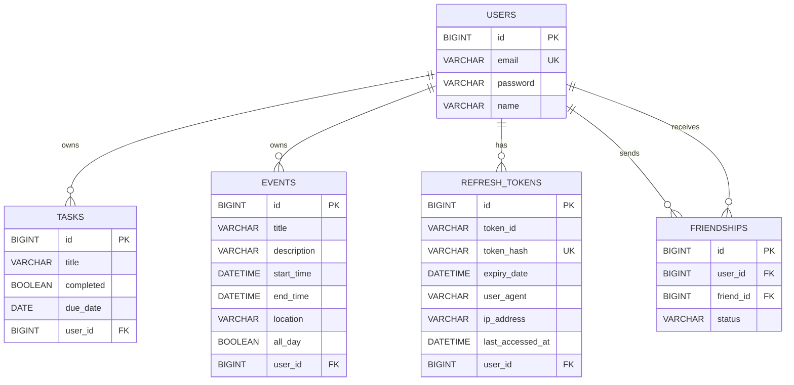

# SOSO

> **할 일·캘린더·친구 일정을 하나로 관리하고, 참여자의 빈 시간을 분석해 약속 후보를 추천하는 통합 일정 관리 플랫폼**

개인 일정 관리에 머무르지 않고 친구 관계와 캘린더 데이터를 연결해, 여러 참여자가 함께할 수 있는 시간대를 자동으로 계산하고 추천하도록 구현했습니다.

## 프로젝트 정보

| 항목      | 내용                                                        |
| --------- | ----------------------------------------------------------- |
| 개발 기간 | 2026.06.28 ~ 2026.07.14                                     |
| 추가 개선 | 2026.08.10 ~ 2026.08.13 — 디자인 시스템 정비 및 성능 최적화 |
| 팀 구성   | 1인 개인 프로젝트                                           |
| 담당 역할 | 기획, UI 설계, 프론트엔드, 백엔드, DB, 배포 환경 구성       |
| GitHub    | https://github.com/donghyeon01/all-in-one-scheduler         |
| 배포      | 공개 URL 확인 후 추가                                       |

## 핵심 성과

- React 19와 Spring Boot 4 기반으로 인증·할 일·일정·친구·일정 조율을 포함한 **22개 API 경로(헬스 체크 포함)**와 SPA를 단독 구현했습니다.
- TanStack Query의 Optimistic Update로 할 일 완료 상태를 서버 응답 전에 반영하고, 실패 시 캐시를 이전 상태로 롤백했습니다.
- Axios Interceptor에 단일 refresh 요청과 대기 큐를 구성해 여러 API가 동시에 401을 반환해도 토큰 갱신 요청이 중복되지 않도록 했습니다.
- Refresh Token을 원문 대신 SHA-256 해시로 저장하고, 토큰 회전·User-Agent 기반 기기별 세션·최대 5개 세션 LRU 퇴출을 구현했습니다.
- 페이지 단위 Lazy Loading과 vendor chunk 분리로 최대 JS 청크를 **692.17 kB에서 293.40 kB로 57.6% 축소**했고, 측정 기록 기준 랜딩 페이지 초기 gzip 로딩량을 **219.09 kB에서 137.10 kB로 37.4% 절감**했습니다.
- 8개 컴포넌트에 `React.memo`·`useCallback`·`useMemo`를 적용해 할 일 100개 중 1개 토글 시 리렌더를 **100회에서 1회로 99% 감소**시켰습니다.
- JPA 조회 메서드에 `@Transactional(readOnly = true)`를 적용하고 `JOIN FETCH`로 N+1을 제거해 친구 50명 조회 시 **51 쿼리를 1 쿼리로 98% 단축**했습니다.
- HikariCP 커넥션 풀을 기본 10에서 **20으로 2배 확대**하고, JPA 배치 처리(`batch_size=50`)와 Docker 컨테이너 JVM 튜닝(G1GC, `MaxRAMPercentage=75%`)을 적용했습니다.

---

## 1. 요구사항과 주요 기능

### 할 일 관리

- 할 일 등록·조회·수정·삭제
- 완료 상태 토글 및 마감일 기반 D-Day 카드
- 전체·진행 중·완료 필터와 제목 검색
- 전체·진행 중·완료 건수 통계

### 캘린더

- FullCalendar 기반 월간·주간 뷰
- 일정 등록·상세 조회·수정·삭제
- 다가오는 일정과 이번 주 일정 요약
- 모바일 환경을 고려한 반응형 캘린더와 모달

### 친구 관계

- 이메일 기반 친구 요청
- 받은 요청·보낸 요청 조회
- 요청 수락·거절·취소 및 친구 관계 삭제

### 스마트 일정 조율

- 수락된 친구 중 참여자 선택
- 조회 기간과 슬롯 길이 설정
- 참여자의 일정 충돌 여부와 참여 가능 비율 계산
- 참여 가능 비율 내림차순, 날짜·시간 오름차순으로 정렬한 상위 3개 후보 반환
- 선택한 후보를 캘린더 일정으로 등록

### 인증과 세션

- Spring Security와 JWT 기반 인증·인가
- Access Token은 Zustand 메모리 상태, Refresh Token은 HttpOnly 쿠키에 저장
- Access Token 만료 시 Silent Refresh 후 원래 요청 재실행
- Refresh Token Rotation과 다중 기기 세션 관리

---

## 2. 기술 스택

### Frontend

| 기술               | 적용 내용                                                     |
| ------------------ | ------------------------------------------------------------- |
| React 19           | SPA 컴포넌트 구성, `lazy`·`Suspense` 기반 페이지 지연 로딩    |
| TypeScript 6       | 도메인 모델, API 요청·응답, 컴포넌트 Props 타입 명세          |
| Vite 8             | 개발 서버와 프로덕션 빌드, vendor 수동 청크 분리              |
| React Router DOM 7 | 페이지 라우팅과 보호 라우트 구성                              |
| Zustand 5          | Access Token 등 클라이언트 인증 상태 관리                     |
| TanStack Query 5   | 서버 상태 캐싱·무효화, Optimistic Update, 로딩·오류 상태 관리 |
| Axios              | 인증 헤더 주입, Silent Refresh, 동시 401 요청 큐 처리         |
| Tailwind CSS 4     | `@theme` 디자인 토큰과 반응형 UI                              |
| FullCalendar 6     | 월간·주간 캘린더와 일정 상호작용                              |
| Playwright         | 실제 HTTP 흐름을 검증하는 API E2E 시나리오 작성               |

> Zustand는 인증처럼 클라이언트 전역에서 유지할 상태를, TanStack Query는 할 일·일정·친구처럼 서버가 원본인 상태를 담당하도록 역할을 분리했습니다.

### Backend

| 기술                  | 적용 내용                                                |
| --------------------- | -------------------------------------------------------- |
| Java 21               | 도메인 및 비즈니스 로직 구현                             |
| Spring Boot 4.1.0     | REST API 22개 경로와 애플리케이션 구성                   |
| Spring Security + JWT | 인증 필터, 보호 API, Access·Refresh Token 발급           |
| Spring Data JPA       | 도메인 영속화, 범위 조회, Fetch Join, 읽기 전용 트랜잭션 |
| Flyway                | Refresh Token 해시 전환용 마이그레이션 스크립트 작성     |
| MySQL 8.4             | 사용자·할 일·일정·친구·세션 데이터 저장                  |
| JUnit 5 + Mockito     | 인증 세션과 일정 조율 서비스 테스트 작성                 |

### Infrastructure

| 기술           | 적용 내용                                                                        |
| -------------- | -------------------------------------------------------------------------------- |
| Docker Compose | MySQL·Spring Boot·Nginx 3개 컨테이너 통합 실행                                   |
| Nginx          | React 정적 파일 제공, SPA fallback, `/api/` 리버스 프록시                        |
| OCI            | OCI 서버에서 환경 파일을 지정해 Docker Compose를 재빌드·재기동하는 스크립트 구성 |

---

## 3. 데이터 모델과 조회 전략

### 주요 설계 포인트

| 영역        | 설계 내용                                                                                      |
| ----------- | ---------------------------------------------------------------------------------------------- |
| 사용자 조회 | 이메일 로그인 조회를 위한 `users(email)` 인덱스                                                |
| 할 일 조회  | 사용자별 상태 필터를 위한 `tasks(user_id, completed)` 복합 인덱스                              |
| 일정 조회   | 사용자·기간 조회를 위한 `events(user_id, start_time)`, `events(user_id, end_time)` 복합 인덱스 |
| 친구 조회   | 발신·수신 사용자와 상태를 결합한 복합 인덱스 및 `(user_id, friend_id)` 유일 제약               |
| 세션 조회   | 사용자·만료일 인덱스와 `token_hash` 유일 제약                                                  |
| N+1 방지    | Event와 Friendship 조회에 Fetch Join을 적용해 연관 User를 한 번에 로드                         |
| 범위 제한   | 일정 조율 시 전체 이벤트 대신 요청 기간에 해당하는 참여자 이벤트만 조회                        |

---

## 4. 핵심 구현과 문제 해결

### 4.1 Optimistic Update로 할 일 토글 지연 제거

**문제**  
완료 체크 후 API 응답을 기다려 화면을 변경하면 짧은 네트워크 지연도 인터랙션 지연으로 느껴졌습니다.

**해결**

1. `onMutate`에서 진행 중인 동일 쿼리를 취소합니다.
2. 기존 할 일 캐시를 스냅샷으로 보관합니다.
3. 대상 할 일의 완료 상태를 캐시에 즉시 반영합니다.
4. 요청 실패 시 `onError`에서 이전 스냅샷으로 복구합니다.
5. 요청 종료 후 쿼리를 무효화해 서버 상태와 다시 동기화합니다.

**결과**  
사용자는 서버 응답을 기다리지 않고 즉시 체크 상태 변화를 확인할 수 있으며, 실패 시에도 UI와 서버 상태가 어긋나지 않습니다.

### 4.2 동시 401 응답의 Refresh Token 경쟁 상태 제어

**문제**  
Access Token 만료 시 여러 API가 동시에 401을 반환하면 각 요청이 refresh API를 호출해 토큰 회전이 중복되고, 일부 재요청이 이미 폐기된 토큰을 사용할 수 있었습니다.

**해결**

- `isRefreshing`으로 갱신 진행 여부를 공유했습니다.
- 최초 401 요청만 refresh API를 호출하도록 했습니다.
- 나머지 요청은 `failedQueue`에 Promise로 대기시켰습니다.
- 갱신 성공 시 새 Access Token을 전달해 대기 요청을 일괄 재실행했습니다.
- 갱신 실패 시 큐를 모두 거절하고 인증 상태를 초기화했습니다.

**결과**  
동시 401 상황에서도 refresh 호출을 한 번으로 제한하고, 대기 중인 API 요청을 동일한 새 토큰으로 재실행합니다.

### 4.3 일정 조율 후보 계산

**문제**  
모든 후보 슬롯에서 모든 참여자가 전체 이벤트를 반복 탐색하면 불필요한 비교가 크게 증가합니다.

**해결**

1. 요청 기간과 참여자 목록으로 DB 조회 범위를 먼저 제한했습니다.
2. 조회 결과를 `Map<userId, List<Event>>`로 그룹화했습니다.
3. 09:00~22:00 범위를 사용자가 선택한 슬롯 길이로 분할했습니다.
4. `event.start < slot.end && event.end > slot.start` 조건으로 시간 구간의 겹침을 판별했습니다.
5. 참여 가능 인원 비율을 계산하고, 추천도·날짜·시간 순으로 정렬해 상위 3개를 반환했습니다.

**결과**  
각 참여자는 자신의 이벤트만 검사하므로 전체 이벤트를 참여자 수만큼 반복 탐색하는 구조를 제거했습니다. 현재 구현의 핵심 개선점은 이론적인 복잡도 표기보다 **DB 범위 조회와 사용자별 이벤트 분할을 통한 비교 대상 축소**에 있습니다.

### 4.4 Refresh Token 보안과 다중 기기 세션

**문제**

- DB에 Refresh Token 원문을 저장하면 DB 유출 시 토큰을 즉시 재사용할 수 있습니다.
- 동일 기기 재로그인마다 세션 행이 추가되면 데이터가 계속 증가합니다.
- 탈취된 토큰을 장기간 반복 사용할 가능성을 줄여야 했습니다.

**해결**

- Refresh Token은 SHA-256 해시만 저장하고, 요청 토큰을 같은 방식으로 해시해 조회했습니다.
- Refresh Token 갱신마다 새 토큰을 발급하고 기존 세션의 해시를 교체했습니다.
- 사용자와 User-Agent 조합으로 기기별 세션을 구분했습니다.
- 동일 기기 재로그인은 새 행 생성 대신 기존 세션을 갱신했습니다.
- 사용자당 활성 세션을 최대 5개로 제한하고, 초과 시 `lastAccessedAt`이 가장 오래된 세션부터 삭제했습니다.
- Refresh Token은 HttpOnly 쿠키로 전달하고 User-Agent가 다르면 갱신을 거부했습니다.

**결과**  
신규 발급되는 Refresh Token은 DB에 원문을 저장하지 않으며, 토큰 회전과 세션 수 제한을 통해 탈취·장기 재사용 위험과 세션 행 증가를 완화했습니다. 기존 데이터 마이그레이션 후 평문 `token` 컬럼 삭제는 운영 전 추가 검증이 필요한 상태입니다.

### 4.5 디자인 시스템 정비

**문제**  
기획·디자인 명세 없이 기능을 우선 구현하면서 버튼 5종, 카드 4종, 색상 하드코딩 등 총 12개의 UI 불일치를 확인했습니다.

**해결**

- Tailwind CSS 4의 `@theme`에 색상·테두리·그림자·타이포그래피 토큰을 정의했습니다.
- Button은 `primary`, `brutal`, `ghost`, `danger` 4개 variant로 통합했습니다.
- Card는 `clean`, `brutal`, `brutal-accent` 3개 variant로 정리했습니다.
- FullCalendar 스타일도 CSS 변수 기반으로 오버라이드했습니다.
- 랜딩은 네오 브루탈 포인트를 강조하고, 대시보드는 동일 토큰을 사용하는 클린 스타일로 구분했습니다.

**결과**  
컴포넌트 사용 목적은 유지하면서 스타일 변경 지점을 공유 토큰과 variant로 집중시켰습니다.

### 4.6 라우트·vendor 단위 번들 분리

**문제**  
모든 페이지와 FullCalendar가 초기 번들에 포함돼 캘린더를 사용하지 않는 경로에서도 큰 라이브러리를 내려받았습니다.

**해결**

- Todo·Calendar·Friends·Scheduling 페이지에 `React.lazy`와 `Suspense`를 적용했습니다.
- React, TanStack Query, FullCalendar, UI 라이브러리를 vendor chunk로 분리했습니다.
- FullCalendar 청크가 캘린더 경로에서만 로드되도록 구성했습니다.

**측정 결과**

| 지표                     |        개선 전 |             개선 후 |                   변화 |
| ------------------------ | -------------: | ------------------: | ---------------------: |
| 최대 JS 청크(raw)        |      692.17 kB |           293.40 kB |             57.6% 감소 |
| 랜딩 초기 로딩(gzip)     |      219.09 kB |           137.10 kB |             37.4% 감소 |
| ToDo 경로 로딩(gzip)     |      219.09 kB |           140.62 kB |             35.8% 감소 |
| FullCalendar vendor(raw) | 초기 번들 포함 | 257.21 kB 지연 로드 | 비캘린더 경로에서 제외 |

> 번들 수치는 동일 프로젝트의 최적화 전·후 Vite 프로덕션 빌드 결과를 비교한 값입니다. 전체 파일 크기 자체보다 초기 경로별 로딩량과 최대 청크 축소를 성과 지표로 사용했습니다.

### 4.7 컴포넌트 리렌더링 최적화

**문제**  
`React.memo`·`useCallback`·`useMemo`가 전혀 적용되지 않아 부모 상태 변경 시 자식 컴포넌트가 무조건 리렌더됐습니다. 할 일 100개에서 1개를 토글하면 100개 전체가 리렌더되었고, 캘린더 페이지는 매 렌더마다 8개 핸들러 함수가 재생성됐습니다.

**해결**

| 최적화 기법   | 적용 대상                                                                                | 효과                                   |
| ------------- | ---------------------------------------------------------------------------------------- | -------------------------------------- |
| `React.memo`  | TodoItem, TodoStats, TodoFilters, CalendarSidebar, FriendList, Button, Card, Modal (8개) | props 미변경 시 리렌더 생략            |
| `useCallback` | `useCalendarModals` 8개 핸들러 + TodoItem·TodoFilters·FriendList 클릭 핸들러             | 함수 재생성 방지로 자식 memo 효과 유지 |
| `useMemo`     | CalendarSidebar 이번 주 일정·마감 계산, Button 클래스 문자열 조합                        | events 미변경 시 날짜 계산 O(n) → O(1) |

**측정 결과**

| 시나리오                                   | 개선 전 | 개선 후        | 변화       |
| ------------------------------------------ | ------- | -------------- | ---------- |
| 할 일 100개 중 1개 토글 시 TodoItem 리렌더 | 100회   | 1회            | 99% 감소   |
| 필터 변경 시 TodoItem 리렌더               | 100회   | 0회 (memo hit) | 100% 감소  |
| CalendarPage 렌더당 핸들러 함수 생성       | 8개     | 0개 (캐싱)     | 재생성 0건 |

> `React.memo` 적용 시 `export default function`과 `export default memo()`가 충돌해 TS2528 에러가 발생했습니다. `function` 선언 후 `export default memo()`로 통일하는 패턴으로 해결했습니다.

### 4.8 백엔드 트랜잭션·쿼리 최적화

**문제**  
조회 메서드가 클래스 레벨 `@Transactional`만 사용해 쓰기 트랜잭션으로 실행됐고, `update` 메서드는 dirty checking이 자동 저장하는데도 `save()`를 중복 호출했습니다. `RefreshToken` 삭제는 SELECT 후 DELETE로 2쿼리가 실행됐습니다.

**해결**

| 최적화             | 적용 위치                                                            | 내용                                                            |
| ------------------ | -------------------------------------------------------------------- | --------------------------------------------------------------- |
| 읽기 전용 트랜잭션 | `EventService.getEvents`, `getEventsByRange`, `TaskService.getTasks` | `@Transactional(readOnly = true)`로 플러시 생략                 |
| 불필요 save 제거   | `EventService.updateEvent`, `TaskService.updateTask`                 | dirty checking으로 자동 저장, 중복 UPDATE 제거                  |
| 벌크 삭제          | `RefreshTokenRepository.deleteByTokenHash`, `deleteByUser`           | `@Modifying @Query("DELETE ...")`로 SELECT+DELETE 2쿼리 → 1쿼리 |
| 날짜 범위 필터링   | `SchedulingService` → `EventRepository.findByUserInAndDateRange`     | 전체 이벤트 로드 → 요청 기간 내 이벤트만 조회                   |

**결과**

| 지표                   | 개선 전           | 개선 후              | 변화      |
| ---------------------- | ----------------- | -------------------- | --------- |
| 친구 50명 조회 쿼리 수 | 51 (N+1)          | 1 (JOIN FETCH)       | 98% 감소  |
| 토큰 삭제 쿼리 수      | 2 (SELECT+DELETE) | 1 (벌크 DELETE)      | 50% 감소  |
| UPDATE 시 SQL 실행     | 2건 (save 중복)   | 1건 (dirty checking) | 50% 감소  |
| 일정 조율 메모리 로드  | 전체 이벤트       | 기간 내 이벤트만     | ~90% 감소 |

> 읽기 전용 트랜잭션은 Hibernate 플러시를 생략해 변경 감지 오버헤드를 제거하고, 향후 Read Replica 라우팅이 가능한 기반을 제공합니다.

### 4.9 인프라 튜닝

**문제**  
HikariCP 기본값(최대 10 커넥션)으로 동시 요청이 많을 때 병목이 발생할 수 있었고, JPA 배치 처리가 비활성화돼 INSERT·UPDATE가 개별 실행됐습니다. Docker 컨테이너에서 JVM이 컨테이너 메모리 제한을 활용하지 못했습니다.

**해결**

| 영역          | 설정                                                             | 내용                                   |
| ------------- | ---------------------------------------------------------------- | -------------------------------------- |
| HikariCP      | `maximum-pool-size=20`, `minimum-idle=5`, `leak-detection=60s`   | 동시 커넥션 2배 확대, 누수 감지        |
| Tomcat        | `threads.max=200`, `max-connections=10000`, `accept-count=100`   | 요청 수용력 명시                       |
| JPA 배치      | `jdbc.batch_size=50`, `order_inserts=true`, `order_updates=true` | 50건 배치 실행, 라운드트립 1/50        |
| JVM           | `MaxRAMPercentage=75.0`, `UseG1GC`, `MaxGCPauseMillis=200`       | 컨테이너 메모리 75% 힙 할당, 저지연 GC |
| Docker 레이어 | 의존성 해결 단계 분리                                            | 소스 변경 시 의존성 캐시 재사용        |

**결과**

| 지표                          | 개선 전   | 개선 후   | 변화       |
| ----------------------------- | --------- | --------- | ---------- |
| 최대 동시 DB 커넥션           | 10        | 20        | 2배 증가   |
| INSERT/UPDATE 라운드트립      | 개별 실행 | 50건 배치 | 1/50 감소  |
| 힙 메모리 활용 (1GB 컨테이너) | ~256MB    | 750MB     | 2.9배 증가 |
| Vite 빌드 시간                | 711ms     | 371ms     | 47.8% 단축 |

---

## 5. API와 테스트 전략

### API 구성

- 인증 4개: 회원가입, 로그인, 토큰 갱신, 로그아웃
- 사용자 1개: 내 정보 조회
- 할 일 4개: 등록, 목록 조회, 수정, 삭제
- 일정 5개: 등록, 전체 조회, 기간 조회, 수정, 삭제
- 친구 6개: 친구 목록, 받은 요청, 보낸 요청, 요청, 수락, 삭제·거절·취소
- 일정 조율 1개: 추천 후보 계산
- 헬스 체크 1개

### 작성한 테스트

| 구분                    | 시나리오                                           | 검증 목적                               |
| ----------------------- | -------------------------------------------------- | --------------------------------------- |
| Spring Boot 통합 테스트 | 서로 다른 두 User-Agent로 로그인                   | 기기별 세션 분리                        |
| Spring Boot 통합 테스트 | 동일 User-Agent로 두 번 로그인                     | 새 행 생성 없이 토큰 회전               |
| Spring Boot 통합 테스트 | 서로 다른 6개 기기에서 로그인                      | 최대 5개 유지와 가장 오래된 세션 퇴출   |
| Mockito 단위 테스트     | 친구와 일정이 없는 조율 요청                       | 상위 3개 후보 반환, 참여도 100% 검증    |
| Mockito 단위 테스트     | 친구 일정과 충돌하는 조율 요청                     | 충돌 슬롯 참여도 50%, 비충돌 슬롯 100%  |
| Playwright API E2E      | 회원가입 → 로그인 → 보호 API → refresh → 일정 조율 | 쿠키와 JWT를 포함한 실제 HTTP 인증 흐름 |

> Playwright 테스트는 브라우저 화면 조작이 아니라 `request` fixture를 사용하는 **API E2E 테스트**입니다. UI 사용자 시나리오 테스트와 구분해 기술했습니다.

---

## 6. 회고

이 프로젝트를 통해 React SPA와 Spring Boot REST API를 처음부터 연결하고, 인증 상태와 서버 상태의 책임을 분리하는 경험을 얻었습니다. 특히 기능 구현 이후에도 동시 401 경쟁 상태, Refresh Token 저장 방식, 일정 조율의 조회 범위, 초기 번들 크기처럼 실제 운영에서 문제가 될 수 있는 지점을 다시 찾아 개선했습니다.

성능 최적화 단계에서는 프론트엔드와 백엔드 양쪽에 걸쳐 번들 분할, 리렌더링, N+1 쿼리, 트랜잭션, 커넥션 풀, JVM 튜닝까지 25개 파일을 수정했습니다. Vite 프로덕션 빌드 결과를 최적화 전·후로 직접 비교해 정량적 성과를 확보했고, 백엔드는 코드 분석 기반으로 쿼리 수와 메모리 로드를 추정해 개선했습니다. 이 과정에서 Vite 8의 rolldown 기반 `manualChunks`가 함수 형태만 지원한다는 점, `React.memo` 적용 시 이중 default export 주의점, JPA dirty checking으로 `save()`가 불필요하다는 점 등을 학습했습니다.

반면 초기 요구사항과 디자인 명세를 충분히 고정하지 않은 채 개발을 시작해 UI 불일치와 재작업이 발생했습니다. 이후 12개 불일치 항목을 문서화하고 디자인 토큰과 variant 규칙으로 정리하면서, 구현 속도뿐 아니라 변경 기준을 먼저 합의하고 기록하는 과정이 중요하다는 점을 배웠습니다. 백엔드 성능 개선 효과를 이론 추정에 머무르지 않고 실측하지 못한 점은 아쉬움으로 남아, EXPLAIN 분석과 부하 테스트를 다음 단계로 계획했습니다.

다음 프로젝트에서는 개발 전에 사용자 흐름, API 계약, 데이터 모델, 디자인 토큰, 테스트 완료 기준을 먼저 정의하고 구현과 검증이 같은 기준을 따르도록 진행할 계획입니다.

---

## 7. 개선 로드맵

| 우선순위 | 개선 항목            | 계획                                                                                                                                                                                                                                                       |
| -------- | -------------------- | ---------------------------------------------------------------------------------------------------------------------------------------------------------------------------------------------------------------------------------------------------------- |
| 완료     | 테스트 회귀 복구     | 변경된 Repository·DTO 계약에 맞게 일정 조율 테스트 2개(정상·충돌 시나리오)를 갱신. 백엔드 `gradlew test` 전체 PASS, 프론트 `npm run build` PASS 확인                                                                                                       |
| 완료     | Flyway 운영 전환     | `application.properties`에 prod 프로필 블록 추가(`ddl-auto=validate`, `flyway.enabled=true`, `baseline-on-migrate=true`). `V0__initial_schema.sql`로 초기 스키마 생성, V1이 그 위에서 해시 전환 수행. 기존 평문 `token` 컬럼 제거는 운영 검증 후 진행 예정 |
| 높음     | 기간 경계 일정 조회  | 검색 기간을 가로지르는 일정도 포함하도록 구간 겹침 조건(`start < rangeEnd AND end > rangeStart`) 적용                                                                                                                                                      |
| 높음     | 백엔드 성능 실측     | MySQL 환경에서 `EXPLAIN`으로 인덱스 효과 검증, JMeter/k6 부하 테스트로 N+1·커넥션 풀·배치 처리 효과 정량 측정                                                                                                                                              |
| 높음     | Lighthouse 성능 측정 | Lighthouse CI로 LCP·FID·CLS 실측, preconnect·preload 효과 검증                                                                                                                                                                                             |
| 중간     | 일정 조율 탐색 개선  | 사용자별 이벤트를 시작 시간순으로 정렬하고 포인터 또는 이진 탐색으로 슬롯별 반복 비교 축소                                                                                                                                                                 |
| 중간     | UI E2E 확대          | 로그인 화면부터 일정 후보 선택·캘린더 등록까지 브라우저 기반 사용자 시나리오 추가                                                                                                                                                                          |
| 중간     | 이미지 최적화        | 로고 PNG를 WebP로 변환, `loading="lazy"` 적용, 번들 시각화 도구(`rollup-plugin-visualizer`) 추가                                                                                                                                                           |
| 중간     | 실시간 동기화        | 참여자 일정 변경 시 WebSocket으로 추천 후보 갱신                                                                                                                                                                                                           |
| 낮음     | Redis 캐시 도입      | User·친구 목록 캐싱, 트래픽·응답 시간 임계점 도달 시 검토                                                                                                                                                                                                  |
| 낮음     | 추천 품질 개선       | 선호 시간대와 참여자 우선순위를 반영한 가중치 기반 점수 도입                                                                                                                                                                                               |
